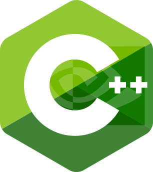

# Remote C++ Development Template for NVIDIA Jetson - jetson-crosscompile-template

## Introduction

NVIDIA Jetson devices are great for edge computing, but the development experience of compiling and storing source code on device is not ideal. `jetson-crosscompile-template` simplifies the process of developing high-performance C++ applications for NVIDIA Jetson using clang and CMake in a Linux or WSL development environment with standardized tooling and workflows. A buffer abstraction API is provided that unifies various CUDA and NVMM memory models and provides Tegra, desktop CUDA, and CPU-only implementations to make your code write-once, run-anywhere. This template is designed to be a starting point for your next project, and includes the following features:

## Features

- **Cross-Compiling Support:** Don't waste time compiling on the Jetson. Build and deploy your application from your development machine.
- **Multiple Deployment Targets:** Easily switch between CPU, CUDA, and Tegra targets.
- **Remote Debugging:** Remote debugging with gdbserver and VSCode.
- **Hardware Buffer Abstractions:** RAII wrappers for CUDA and NVMM buffers with Tegra, CUDA desktop, and CPU-only implementations for on and off-device testing.
- **Modern C++ & CMake:** Utilizes recent standards in C++ and CMake for efficient development.
- **Dependency Management:** Easily add and manage dependencies with CPM. Provided scripts fetch the required NVIDIA packages for cross-compiling.
- **Testing:** Unit testing with Catch2 and CTest.
- **Linter Support:** Automatic linting with clang-format, cmake-format, and clang-tidy.
- **Static Analysis:** Static analysis with clang-tidy.
- **Code Coverage:** Code coverage with llvm-cov and gcovr.
- **Continuous Integration:** CI with GitHub Actions for automatic linting, building, testing, static analysis, and code coverage.

|                | CPU | CUDA | NVMM |
| -------------- | :-: | :--: | :--: |
| GitHub Actions | ✅  |  ❌  |  ❌  |
| Linux/WSL      | ✅  |  ✅  |  ❌  |
| Jetson         | ✅  |  ✅  |  ✅  |

_Supported backends for different deployment targets. GitHub Actions can be extended to support CUDA and Tegra targets with [Custom Runners](https://docs.github.com/en/actions/hosting-your-own-runners/managing-self-hosted-runners/about-self-hosted-runners)._

## Getting Started

1. Clone This Template: Use [this template](https://github.com/jhurliman/jetson-crosscompile-template) to create a new repository, then git clone the new repository to your machine.
2. Set Up Your Environment: Follow the setup guide [here](docs/GettingStarted.md).
3. Build and Run: Use the [Makefile](Makefile) to build and run the project, or use the [VSCode Tasks](.vscode/tasks.json) to build, run, and debug.

## How to Contribute

Contributions of all kinds are welcome! Use GitHub issues and pull requests for bug reports, feature requests, and code contributions.

## License

This project is open source and available under the [MIT License](LICENSE). Developed by [John Hurliman](https://jhurliman.org/).

## TODO

- [x] ctest unit test
- [x] CPM dependency management
- [x] Add support for more Jetson devices
- [ ] fix <<<...>>> clang warning for CUDA kernel launch
- [ ] C++23
